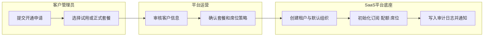
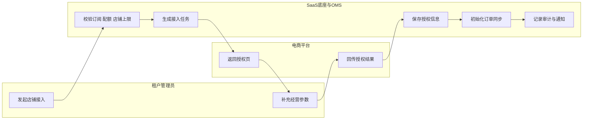
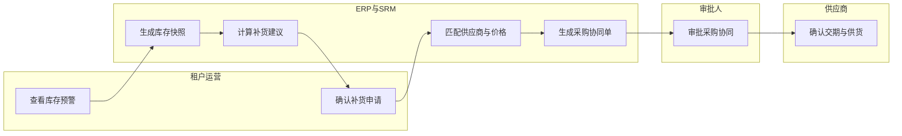
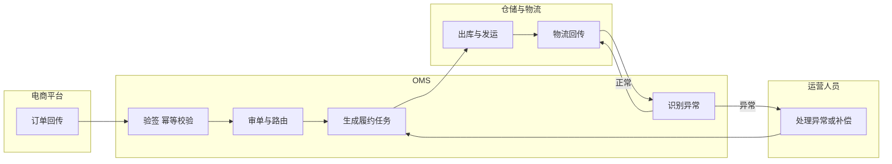
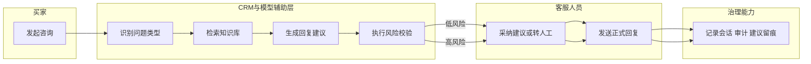
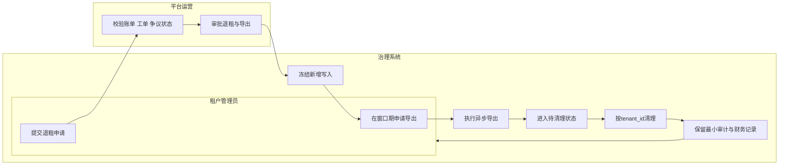

# 关键流程泳道图文档

| 文档名称 | 文档类型 | 当前版本 | 适用对象 | 主要读者 | 维护状态 |
| --- | --- | --- | --- | --- | --- |
| 关键流程泳道图文档 | 架构/流程设计 | v1.1 | 核心链路评审、研发对齐、测试验收 | 产品、架构、研发、测试、平台运营 | 已整理 |

## 1. 文档目的
本文档将商用版最关键的跨系统流程整理为泳道图，用于明确 `SaaS 平台底座 + OMS + SRM + ERP + CRM + WMS/TMS + BI` 协同过程中的角色边界、系统职责、校验点与留痕要求。

## 2. 泳道图说明
- 泳道按真实参与角色拆分，不按代码模块拆分。
- 重点观察“谁发起、谁校验、谁执行、谁留痕、谁兜底”。
- 详细字段、状态和接口定义仍以专题设计文档为准。

## 3. 租户开通与订阅初始化

## 4. 店铺接入与 OMS 初始化

## 5. 补货建议到采购协同

## 6. 订单履约与异常补偿

## 7. 客户服务辅助与人工接管

## 8. 退租与数据清理

## 9. 标准使用方式
- 产品评审时，先用本文件确认流程闭环，再回到需求和接口文档补齐细节。
- 开发排期时，按泳道图拆分前端、后端、模型能力和测试任务。
- 测试验收时，将每条泳道上的关键节点转成测试用例。

## 10. 关联文档
- [产品需求文档](../../requirements/product/01-产品需求文档.md)
- [角色与权限说明](03-角色与权限说明.md)
- [多租户SaaS隔离与平台运营设计整理](09-多租户SaaS隔离与平台运营设计整理.md)
- [租户数据保留与退租清理策略](11-租户数据保留与退租清理策略.md)
- [SDD开发设计文档](10-SDD开发设计文档.md)
